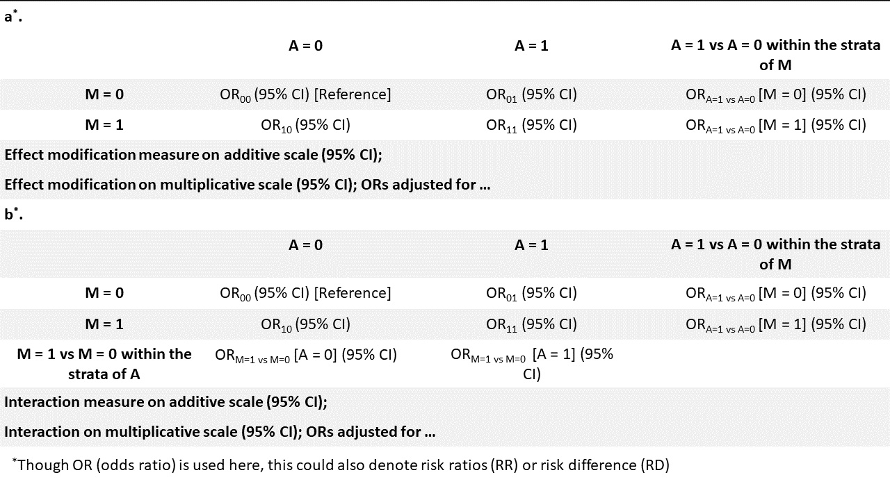

Summary
=======

Effect modification and/or Interaction are frequently assessed in
epidemiological research. However, in most cases, authors do not present
sufficient information for the readers to fully assess the extent and
significance of interaction on both additive and multiplicative scale.
Also, despite its well documented poor performance compared to
alternative methods, the delta method has proliferated in the literature
for the estimation of confidence intervals (CIs) for measures of
additive interactions due to being readily available in most software.

We introduce interactionR, an open-source R package with user-friendly
functions that ensures full reporting of effect modification or
interaction based on recommended guidelines. In addition to the simple
asymptotic delta method, the package also allows for estimation of CIs
for additive interaction measures using the variance recovery and
percentile bootstrapping methods.

Statement of need
==================

Although, effect modification analysis is ubiquitous in the
epidemiologic literature, its reporting is grossly inadequate (Knol,
Egger, Scott, Geerlings, & Vandenbroucke, 2009). For example, whereas
departure from additivity is more relevant to disease prevention and
intervention in public health (Rothman, Greenland, & Walker, 1980), most
studies only report interaction on the multiplicative scale since this
can be easily extracted from the exponentiated coefficient of the
product term of two exposures in a logistic regression model (Knol et
al., 2009).

To improve this situation, Knol and Vanderweele proposed a set of
recommendations for the reporting of analyses of effect modification
(Knol & VanderWeele, 2012). In their recommendation, they distinguished
effect modification from interaction. Effect modification is when the
effect of an exposure on an outcome differs within the strata of a
second exposure, while interaction is the causal effect of two exposures
together on an outcome. For an effect modification analysis with three
dichotomous variables: the effect of exposure A on an outcome Y and a
putative modifying variable M of this effect, they recommended reporting
mainly the following (Table 1a):

1.  Individual (A on Y (OR01) and M on Y (OR10)) and joint effect
    estimates (A and M on Y (OR11)) with confidence intervals (CI) ,
    with the stratum of lowest risk (OR00) as the reference
2.  Estimates and CIs of the effect of A on Y within the strata of M and
3.  Measures of additive (e.g. Relative Excess Risk due to Interaction,
    RERI) and multiplicative effect modification with CIs.

If interaction of A and M on Y is of interest, then to report in
addition to the above, estimates and CI of the effect of M on Y within
the strata of A (Table 1b). Presenting the results this way allows the
reader to fully interpret all dimensions of interaction (Knol &
VanderWeele, 2012).

Table 1: Recommended presentation formats for effect modification and
interaction analyses

Fitting a regression model in R will produce some direct estimates
required to populate Figure 1; however, estimates such as RERI, ORA=1
vs A=0[M = 1], ORM=1 vs M=0[A = 1] and their CIs are not
readily available from the standard output of the regression model and
need to be produced with additional methods and coding. These additional
steps required may deter the more parsimonious authors from full
reporting based on the recommendations presented above.

Complicating things further are the competing methods in the literature
for the estimation of CIs around these measures of additive interaction
(i.e. RERI, Attributable Proportion (AP) and Synergy Index (SI)). The
first such method was the simple asymptotic delta method proposed by
Hosmer and Lemeshow (Hosmer & Lemeshow, 1992), which is the most widely
used in the literature despite its well-documented poor performance
(Assmann, Hosmer, Lemeshow, & Mundt, 1996; Zou, 2008). To overcome the
shortcomings of this method, Assmann et al. (Assmann et al., 1996)
suggested a non-parametric bootstrapping approach for CI of RERI, where
RERI is estimated each time in a specified number (usually 1000) of
bootstrap replications (with replacement) of the original sample. Then
the 95% CI of RERI is the 2.5th and 97.5th percentile of the resulting
distribution. However, this method, although has a superior performance
if the sample size is large enough (Assmann et al., 1996; Zou, 2008),
falls apart at typical sample sizes at which most observational studies
are performed at due to the inevitable sparse cells in some of the
bootstrap simulations (Richardson & Kaufman, 2009). However, the
variance recovery (‘MOVER’) method that was subsequently proposed by Zou
(Zou, 2008) demonstrated better performance to the delta method at
typical sample sizes and a comparable performance to bootstrapping at
larger sample sizes.

Although, there exist R functions (Andersson, Alfredsson, Källberg,
Zdravkovic, & Ahlbom, 2005; Mathur & VanderWeele, 2018) to estimate
relevant measures of additive interactions, they all compute CIs using
the easily implemented delta method. The easy availability of the delta
method for estimation of CIs of additive interaction measures across the
major statistical software may explain its continuing prominence in the
literature. In this paper, we introduce ‘interactionR’, an R package
that ensures full reporting of effect modification and interaction in easy steps. It also provides for the first time in R
the option of computing the CIs for measures of additive interaction
with all the methods described above.

Acknowledgements
================

I thank Sreenath A. Madathil for being the first tester and for critical feedback about the design of the earlier version of the package, and Belinda Nicolau for helpful comments regarding the manuscript.

References
==========
