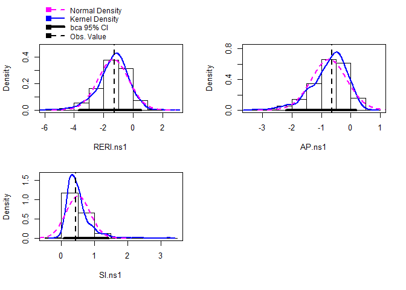

About interactionR
==================

[](https://travis-ci.com/epi-zen/interactionR)

InteractionR allows researchers to produce publication-ready tables that
includes all effect estimates necessary for full reporting effect
modification and interaction analysis as recommended by Knol and
Vanderweele (2012)
\[<a href="doi:10.1093/ije/dyr218" class="uri">doi:10.1093/ije/dyr218</a>\].
It also estimates confidence interval for the trio of additive
interaction measures using the delta method (Hosmer and Lemeshow (1992),
\[<a href="doi:10.1097/00001648-199209000-00012" class="uri">doi:10.1097/00001648-199209000-00012</a>\]),
variance recovery method (Zou (2008),
\[<a href="doi:10.1093/aje/kwn104" class="uri">doi:10.1093/aje/kwn104</a>\]),
or percentile bootstrapping (Assmann et al. (1996),
\[<a href="doi:10.1097/00001648-199605000-00012" class="uri">doi:10.1097/00001648-199605000-00012</a>\]).

Installation
============

interactionR is on
[CRAN](https://cran.r-project.org/package=interactionR), install using
`install.packages("interactionR")`.

You can also install the development version from
[GitHub](https://github.com/epi-zen/interactionR) with:

``` r
# install.packages("devtools")
devtools::install_github("epi-zen/interactionR")
```

Implementation
==============

interactionR is implemented in the R statistical software environment; R
is installable from
<a href="https://www.r-project.org/" class="uri">https://www.r-project.org/</a>.
The main user-facing function of the package, `interactionR()`, accepts
the following arguments:

\*\*model\*: a regression model fitted by the user with interaction term
for the two exposures under consideration. This may be an object of
class glm with a valid link for logistic regression or approximants of
risk ratio, class clogit or class coxph. It can also include confounders
adjustment as is usually the case.

\*\*exposure\_names\*: A character vector of two named binary exposure
variables present in the fitted model.

\*\*ci.type\*: A character string (“delta” or “mover”) specifying the
method to use for the estimation of CI for the measures of additive
interaction. Default is “delta”.

\*\*ci.level\*: Magnitude of the returned CI level.

\*\*em\*: TRUE, for effect modification assessment. FALSE, for
interaction.

\*\*recode\*: If TRUE, recodes the exposures - if at least one of the
exposures is protective - such that the stratum with the lowest risk
becomes the new reference category when the two exposures are considered
jointly (See Knol et al (2011) \[doi: 10.1007/s10654-011-9554-9\]).

Example: The joint effect of alcohol and smoking on oral cancer.
================================================================

Consider the case-control data from Rothman and Keller (1979) \[doi:
10.1016/0021-9681(72)90006-9\], which studied the joint effect of
alcohol and smoking on oral cancers. This dataset was used previously by
Hosmer and Lemeshow, and Zou and its included in our package as ‘OCdata’
for easy replication of our analysis by the user. It contains the two
exposures, alcohol (‘alc’) and smoking (‘smk’), and the outcome, oral
cancer (‘oc’) as dichotomous variables (0 or 1, indicating absence or
presence respectively). Suppose we are considering interaction and we
want to compute the CIs for the measures of additive interaction using
the MOVER method, we will start by fitting the following logistic
regression model with an interaction term for alcohol and smoking on
oral cancer:

``` r
library(interactionR)
data (OCdata)

## fit the interaction model
model.glm <- glm(oc ~ alc*smk, family = binomial(link = "logit"), data = OCdata)
```

Then, pass the fitted model to the function which generates a list
object of class ‘interactionR’

``` r
table_object = interactionR(model.glm, exposure_names = c("alc", "smk"), ci.type = "mover", ci.level = 0.95, em = F, recode = F)
```

This returns a list object of class interactionR which includes a
dataframe containing all the effect estimates that are necessary to
fully report effect modification or interaction. This data frame and
other components of the list are accessible to the user for further
manipulation, if desired. Importantly, the output object is formatted in
such a way that the data frame can be processed by the tabling function
`interactionR_table()`. An example is:

``` r
interactionR_table(table_object)
#> Do you want to save a Microsoft Word copy of the em/interaction table to your working directory? (yes/No/cancel) 
#> a flextable object.
#> col_keys: `*`, `smk absent`, `smk present`, `Effect of smk within the strata of alc` 
#> header has 1 row(s) 
#> body has 9 row(s) 
#> original dataset sample: 
#>                                        *        smk absent        smk present
#> 1                                   <NA>              <NA>               <NA>
#> 2                                   <NA>       OR [95% CI]        OR [95% CI]
#> 3                             alc absent     1 [Reference] 2.96 [0.68, 12.91]
#> 4                            alc present 3.33 [0.7, 15.86] 9.04 [2.64, 30.91]
#> 5 Effect of alc within the strata of smk 3.33 [0.7, 15.86]  3.05 [1.29, 7.18]
#>   Effect of smk within the strata of alc
#> 1                                   <NA>
#> 2                            OR [95% CI]
#> 3                     2.96 [0.68, 12.91]
#> 4                         2.71 [1, 7.37]
#> 5                                   <NA>
```

The tabling function will generate and save a publication-ready table as
a word document to the user’s working directory, if desired. The
returned point estimate and CI for RERI (3.74; 95% CI: -11.43, 21.87) is
as reported by Zou for this data (13) – If the ‘ci.type’ argument in the
`interactionR()` call had been set to “delta”, the CIs for this trio of
interaction measures would be as reported by Hosmer and Lemeshow.

In addition to the main function described above, the package also
provides standalone functions for each of the CI estimating methods:
interactionR\_mover(), interactionR\_delta(), and interactionR\_boot().
The latter implements the percentile bootstrapping of CIs of additive
interaction measures as described by Assmann et al, with usage shown in
the next example.

Example 2: Effect of sports participation and smoking on herniated lumbar disc.
===============================================================================

To illustrate the interactionR\_boot() function, consider the
case-control data of the effect of sports participation and smoking on
herniated lumbar disc examined by Assmann et al. in their analysis. The
dataset is available in the package as ‘HDiscdata’ and contains three
binary variables: i) the outcome. herniated lumbar disc, ‘h’; and ii &
iii) the exposures sports participation, ‘ns’, and smoking ‘smk’. The
function accepts the following arguments:

\*\*model\*: A fitted model of class glm. Requires the exposures with
interaction term to be listed first before any other
covariates/confounders (if applicable).

\*\*ci.level*; *em*; *recode\*: As previously described for
`interactionR()`.

\*\*seed\*: The random number seed to use for generating the bootstrap
samples (for reproducibility). Default is 12345 but can be set to any
number.

\*\*s\*: Number of bootstrap resampling. Default is 1000

Again, we start by fitting a logistic regression model:

``` r
data(HDiscdata)
m2 = glm(h ~ ns*smk, family = binomial(link = 'logit'), data = HDiscdata)
```

Then, pass the object to the `interactionR_boot()` function as follows:

``` r

table_object2 = interactionR_boot(m2, ci.level = 0.95, em = F, recode = F, seed = 12345, s = 1000)
#> Loading required namespace: boot
```

This runs a non-parametric bootstrap sample 1000 times with replacements
and a percentile CI. The function also returns a list object of class
interactionR containing all the desired estimates and manipulable by the
tabling function - `interactionR_table()` - described earlier. Calling
`interactionR_table()` on the returned object produces a
publication-ready table with estimates for the CI of RERI and AP similar
to that reported by Assmann et al. for this data.

``` r

interactionR_table(table_object2)
#> Do you want to save a Microsoft Word copy of the em/interaction table to your working directory? (yes/No/cancel) 
#> a flextable object.
#> col_keys: `*`, `smk1 absent`, `smk1 present`, `Effect of smk1 within the strata of ns1` 
#> header has 1 row(s) 
#> body has 9 row(s) 
#> original dataset sample: 
#>                                         *       smk1 absent      smk1 present
#> 1                                    <NA>              <NA>              <NA>
#> 2                                    <NA>       OR [95% CI]       OR [95% CI]
#> 3                              ns1 absent     1 [Reference] 1.88 [1.29, 2.73]
#> 4                             ns1 present 2.38 [1.27, 4.46] 1.98 [1.12, 3.48]
#> 5 Effect of ns1 within the strata of smk1 2.38 [1.27, 4.46] 1.05 [0.61, 1.83]
#>   Effect of smk1 within the strata of ns1
#> 1                                    <NA>
#> 2                             OR [95% CI]
#> 3                       1.88 [1.29, 2.73]
#> 4                       0.83 [0.39, 1.75]
#> 5                                    <NA>
```

Furthermore, some base R functions are available to the user to further
manipulate some parts of the output object from interactionR\_boot(). A
simple example is:

``` r

hist(table_object2$bootstrap)
```



This produce histograms of the distribution of each of the three
bootstrapped parameters (RERI, AP and SI), allowing the user to inspect
the overall performance and accuracy of the returned estimates.

Community guidelines
====================

### To contribute

For contribute to interactionR please feel free to fork the branch and
send me pull requests. Currently, only the master branch is used for
both development and releases.

### To report problems, bugs or issues

Please use [interactionR
issues](https://github.com/epi-zen/interactionR/issues) here on Github.

### To get support

Please consult the help files for the package within R, or ask questions
on the [Github discussion
board](https://github.com/epi-zen/interactionR/discussions) or contact
the maintainer at Babatunde Alli
[babatunde.alli@mail.mcgill.ca](babatunde.alli@mail.mcgill.ca)
